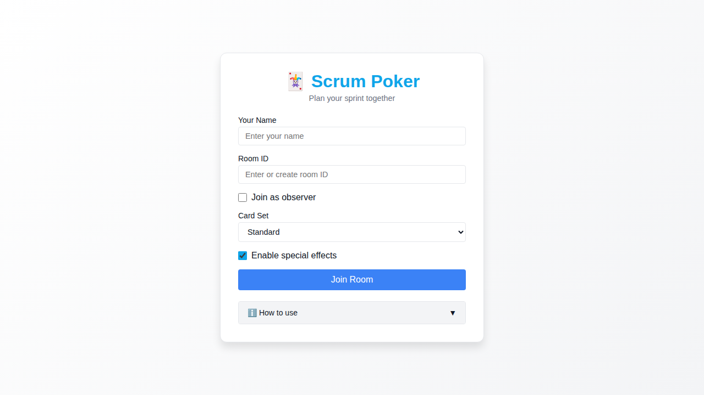
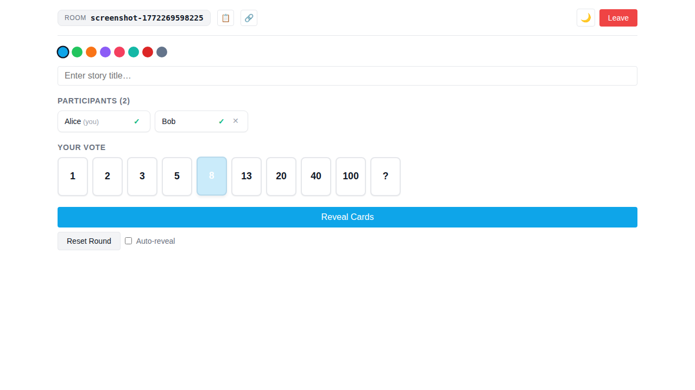
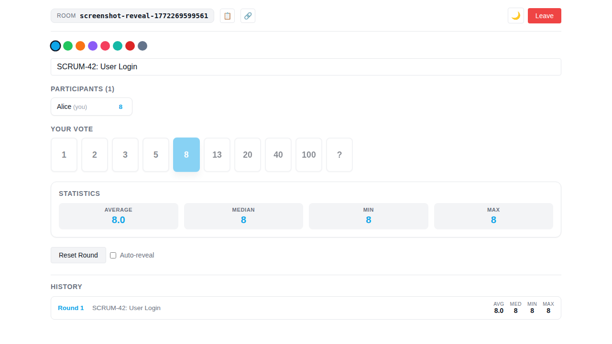

# Scrum Poker — React + Spring Boot Rewrite

A real-time networked Scrum Poker application for agile teams, rewritten with:
- **Backend**: Spring Boot 3 (Java 17) + STOMP WebSocket
- **Frontend**: React 19 + TypeScript + Vite

## Screenshots

| Welcome Screen | Voting Room |
|---|---|
|  |  |

| Revealed Results |
|---|
|  |

## Features

- 🃏 **Real-time Collaboration** — Multiple users per room, votes broadcast instantly via WebSocket
- 📊 **Instant Results** — Average, median, min, max when cards are revealed
- 🎴 **Multiple Card Sets** — Standard, Fibonacci, T-Shirt Sizes, Powers of 2
- 👥 **Observer Mode** — Join without voting
- 🌓 **Theme Toggle** — Light / dark (saved per browser)
- 🎨 **Color Palettes** — 8 built-in palettes
- 📝 **Story Title** — Host can label each round
- ⚡ **Auto-reveal** — Reveal automatically when all voters have voted
- 🎉 **Special Effects** — Confetti on consensus
- 📜 **Round History** — Log of past rounds shown after each reveal
- 🔗 **Shareable URL** — `?room=` query parameter auto-syncs the room
- 👑 **Host Controls** — Reveal/reset, remove participants
- 🔄 **Reconnect Grace Period** — Page refreshes preserve vote and membership
- 🏠 **Host Takeover** — If host is absent >1 min, participants can take over
- 📱 **Responsive Design** — Desktop, tablet and mobile

## Project Structure

```
.
├── backend/          # Spring Boot 3 / Java 17
│   └── src/
│       ├── main/java/com/scrumpoker/
│       │   ├── config/        WebSocketConfig
│       │   ├── health/        REST /health  /ready
│       │   └── room/          STOMP WebSocket handlers + domain
│       └── test/              JUnit 5 — 100 % coverage target
├── e2e/              # Playwright end-to-end tests (39 tests)
│   ├── welcome.spec.ts   Welcome screen validation
│   └── room.spec.ts      Full voting workflow, observer, story, host controls
├── frontend/         # React 19 + TypeScript + Vite
│   └── src/
│       ├── features/welcome/  WelcomeScreen
│       ├── features/room/     VotingRoom, cards, stats, history
│       ├── hooks/             useRoom (STOMP state hook)
│       └── services/          StompService (mockable)
├── docs/screenshots/          App screenshots (auto-generated by e2e tests)
├── playwright.config.ts       Playwright configuration
├── package.json               Root-level E2E test dependencies
├── Dockerfile                 Multi-stage build
├── openshift-deployment.yaml  OpenShift Deployment / Service / Route
└── .github/
    ├── copilot-instructions.md  AI agent instructions (README, screenshots, conflicts)
    └── workflows/ci.yml         CI: backend + frontend + Docker + Playwright E2E
```

## Local Development

### Prerequisites
- Java 17+
- Maven 3.9+
- Node.js 20+

### Backend

```bash
cd backend
mvn spring-boot:run
```

The backend starts on `http://localhost:8080`.

### Frontend (dev server with proxy to backend)

```bash
cd frontend
npm install
npm run dev
```

Open `http://localhost:5173`.

## Testing

### Backend (JUnit 5 + Spring Boot Test)

```bash
cd backend
mvn test          # run tests
mvn verify        # run tests + JaCoCo coverage check
```

### Frontend (Vitest + React Testing Library)

```bash
cd frontend
npm test                # watch mode
npm run test:coverage   # single run with coverage report
```

### End-to-End Tests (Playwright)

The E2E suite spins up the full app in Docker and runs 39 Playwright tests covering all
functionality: joining, voting, reveal/reset, statistics, observer mode, story title,
auto-reveal, leave room, host controls, remove participant, and all four card sets.

#### Running locally

```bash
# 1. Build and start the app
docker build -t scrumpoker .
docker run -d --name sp-e2e -p 8080:8080 scrumpoker
timeout 60 bash -c 'until curl -sf http://localhost:8080/health; do sleep 2; done'

# 2. Install Playwright browsers (once)
npm ci
npx playwright install chromium

# 3. Run all tests
npm run test:e2e

# 4. Clean up
docker stop sp-e2e
```

#### Updating screenshots

The `README screenshots` test group in `e2e/room.spec.ts` automatically writes PNG files to
`docs/screenshots/` when it runs. After UI changes, regenerate screenshots and commit them:

```bash
npm run test:e2e -- --grep "README screenshots"
git add docs/screenshots/
git commit -m "docs: update screenshots"
```

## Production Build

Build the complete Docker image (frontend embedded in the Spring Boot jar):

```bash
docker build -t scrumpoker:latest .
docker run -p 8080:8080 scrumpoker:latest
```

Open `http://localhost:8080`.

## Deployment

### OpenShift

```bash
# Build and push your image
docker build -t your-registry/scrumpoker:latest .
docker push your-registry/scrumpoker:latest

# Update the image reference in openshift-deployment.yaml, then:
oc apply -f openshift-deployment.yaml
```

The deployment includes liveness/readiness probes (`/health`, `/ready`), resource limits, TLS edge termination, and a non-root security context.

## CI

Every push and pull request runs three parallel jobs:

| Job | Matrix | What it does |
|---|---|---|
| **backend** | Java 17, 21 | `mvn verify` — 51 JUnit tests + JaCoCo coverage |
| **frontend** | Node 20, 22, 24 | Vitest — 77 tests + coverage |
| **e2e** | — | Builds Docker image, starts container, runs 39 Playwright tests |

Playwright HTML reports and screenshots are uploaded as GitHub Actions artifacts.

## Architecture

| Layer | Technology |
|---|---|
| Backend API | Spring Boot 3 / Spring MVC |
| Real-time | Spring WebSocket (STOMP) |
| Frontend | React 19 + TypeScript (Vite) |
| WebSocket client | @stomp/stompjs + SockJS |
| Backend tests | JUnit 5 + Mockito + Spring Boot Test |
| Frontend tests | Vitest + React Testing Library |
| E2E tests | Playwright (Chromium) |
| Container | Docker multi-stage (JRE 17 Alpine) |
| CI | GitHub Actions |
| Cloud | OpenShift-ready |

## License

GPL-3.0 — see [LICENSE](LICENSE).
